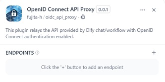
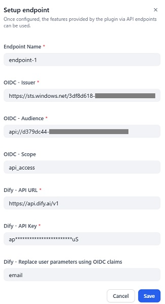
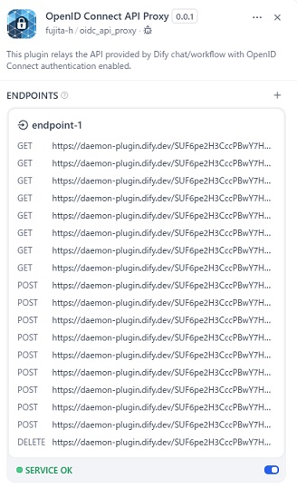

# Overview

This plugin provides the same API endpoints as the Dify Chat/Workflow API, but uses OpenID Connect authentication instead of Dify's API key authentication.

You can use the endpoints created by this plugin to provide per-user authentication to the API.

# Features

## OpenID Connect authentication

This plugin uses OpenID Connect authentication to authenticate users. You can access the API with the access token obtained by authenticating with OpenID Connect.

## User parameter replacement

You can also replace the `user` parameter specified in the original API with OpenID Connect authenticated claim data. For example, if you replace it with an email address, the user's email address will be displayed on the Dify app log screen.

## Input claim data to the Chat/Workflow App

Plugin automatically inputs the claim data obtained by OpenID Connect authentication into the Chat/Workflow App. You can use the claim data in the Chat/Workflow App.

To use the claim data in the Chat/Workflow App, you need to specify the claim data name to the Start node's `input` parameter. For example, if you specify `__oidc_email` to the `input` parameter, you can use the email address in the Chat/Workflow App.

# Configuration

## 1. Install the plugin

Install the plugin by clicking on the **Install** button.

## 2. Add a endpoint

Open the plugin, and click on the **+** button.



Input the OpenID Connect configuration and the API endpoint you want to relay, and click on the **Save** button.



## 3. Access the endpoint

Now you can use the endpoint you created. You can see the list of API endpoints.



For example, the original Dify API endpoint for sending a chat message is `https://api.dify.ai/v1/chat-messages`.

```shell
curl -X POST 'https://api.dify.ai/v1/chat-messages' \
--header 'Authorization: Bearer {api_key}' \
--header 'Content-Type: application/json' \
--data-raw '{
    "inputs": {},
    "query": "What are the specs of the iPhone 13 Pro Max?",
    "response_mode": "streaming",
    "conversation_id": "",
    "user": "abc-123",
    "files": [
      {
        "type": "image",
        "transfer_method": "remote_url",
        "url": "https://cloud.dify.ai/logo/logo-site.png"
      }
    ]
}'
```
In this scnario, the OpenID Connect API Proxy endpoint for sending a chat message is `https://daemon-plugin.dify.dev/SUF6pe2H3CccPBwY7H.../chat-messages`.

```shell
curl -X POST 'https://daemon-plugin.dify.dev/SUF6pe2H3CccPBwY7H.../chat-messages' \
--header 'Authorization: Bearer {OpenID Connect Access Token}' \
--header 'Content-Type: application/json' \
--data-raw '{
    "inputs": {},
    "query": "What are the specs of the iPhone 13 Pro Max?",
    "response_mode": "streaming",
    "conversation_id": "",
    "user": "abc-123",
    "files": [
      {
        "type": "image",
        "transfer_method": "remote_url",
        "url": "https://cloud.dify.ai/logo/logo-site.png"
      }
    ]
}'
```

# Report Issues and Contributing

Please report any issues to the [GitHub repository](https://github.com/fujita-h/dify-plugin-oidc-api-proxy).  
This plugin is open-source and contributions are welcome.
